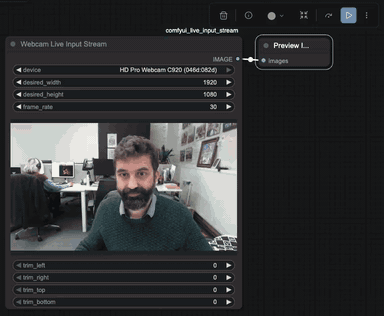
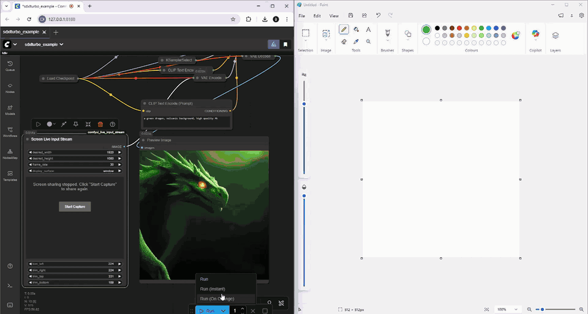
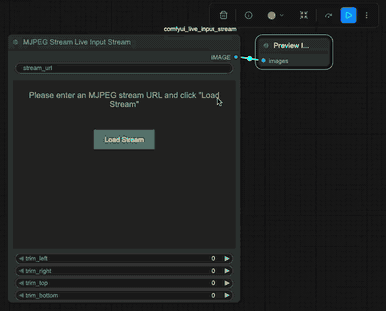

# ComfyUI Live Input Stream

Real-time video input nodes for ComfyUI that enable webcam capture, screen sharing, and MJPEG stream processing with live preview and cropping capabilities.

## Quickstart

1. Install [ComfyUI](https://docs.comfy.org/get_started).
1. Install [ComfyUI-Manager](https://github.com/ltdrdata/ComfyUI-Manager)
1. Look up this extension in ComfyUI-Manager. If you are installing manually, clone this repository under `ComfyUI/custom_nodes`.
1. Restart ComfyUI.

## Features

This extension provides three powerful input nodes for working with live video streams in ComfyUI:

### 🎥 Webcam Live Input Stream

Capture live video from your webcam with full control and preview.

- **Device Selection**: Choose from available webcam devices
- **Live Preview**: See your webcam feed directly in the ComfyUI interface
- **Real-time Cropping**: Trim left, right, top, and bottom with live preview of cropped area
- **High Resolution Support**: Automatically requests the highest resolution available from your camera

### 🖥️ Screen Live Input Stream

Capture and process your screen, windows, or browser tabs in real-time.

- **Flexible Source Selection**: Choose between monitor, window, or browser tab capture
- **Resolution Control**: Set ideal width and height constraints (default 1920x1080)
- **Frame Rate Control**: Adjust frame rate from 1-120 fps (default 30 fps)
- **Live Preview**: View the captured screen with trimming applied in real-time
- **Real-time Cropping**: Trim any edges with live preview

### 📡 MJPEG Stream Live Input Stream

Connect to external MJPEG streams from IP cameras, video servers, or other sources.

- **URL Input**: Simply enter any MJPEG stream URL
- **CORS Proxy**: Built-in Python proxy layer automatically handles CORS restrictions
- **Real-time Cropping**: Trim any edges with live preview

## Use Cases

- **Webcam Effects**: Apply ComfyUI image processing to live webcam feeds
- **Screen Recording Workflows**: Process screen captures with AI models in real-time. You could for example use this to capture a drawing application window and have ComfyUI enhance or modify the drawing live as you create it.
- **IP Camera Integration**: Connect security cameras or video streams to ComfyUI
- **Live Demonstrations**: Capture and process live content for presentations